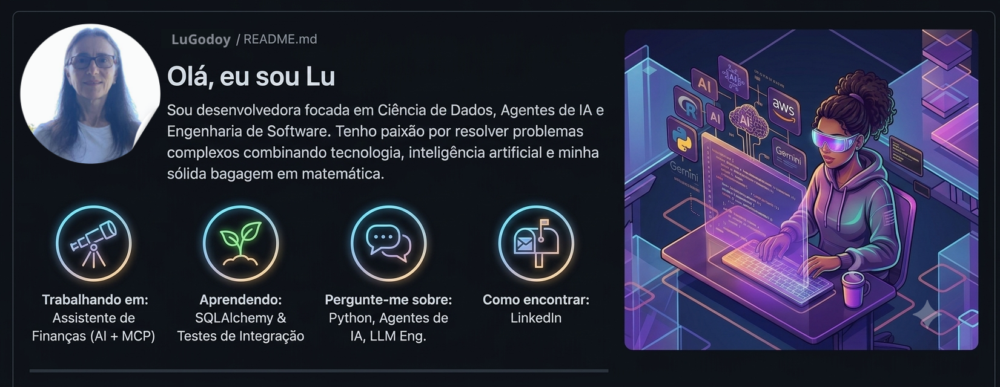

 

# Olá, eu sou Lu 
Sou desenvolvedora focada em **Data Science**, **AI Agents** e **Software Engineering**. 
Tenho paixão por resolver problemas complexos combinando tecnologia, inteligência artificial e minha sólida bagagem em matemática.

- 🔭 Atualmente trabalhando em: Assistente de Finanças com AI Agents + MCP
- 🌱 Atualmente aprendendo: SQLAlchemy, testes de integração
- 💬 Pergunte-me sobre: Python, AI Agents, LLM Engineering
- 📫 Como me encontrar: [LinkedIn](https://www.linkedin.com/in/luciene-godoy-b8670a179/)
Data Science • AI Agents • Software Engineering • Matemática

🚀 **Linguagens & Frameworks:** Python (3.13+), Streamlit, MySQL e SQLAlchemy

💼 **Ferramentas de IA & Cloud:** Google Gemini, Model Context Protocol (MCP), Amazon Bedrock, AWS Lambda, S3 e DynamoDB
